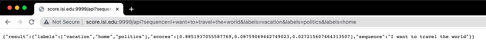
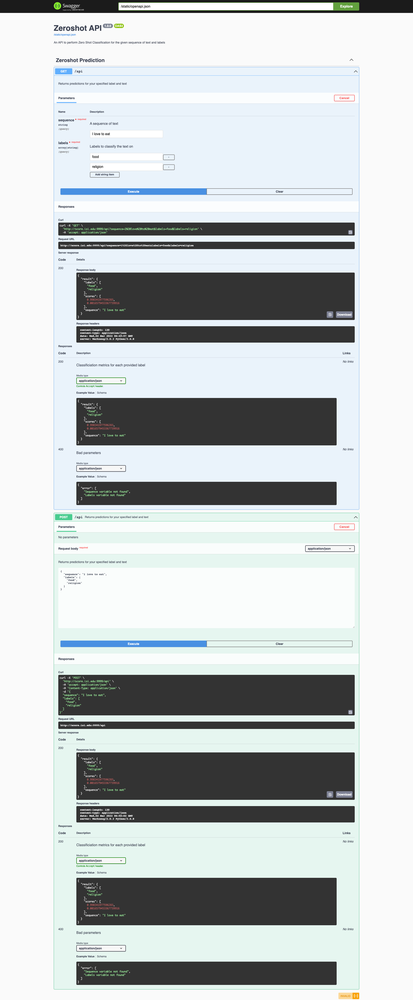

# README

A simple Flask-based GET and POST API to utilize Hugging Face's [Zero Shot Text Classification model](https://huggingface.co/facebook/bart-large-mnli).

- [x] Implement Model
- [x] Implement Flask
- [x] Add Documentation (Swagger)
- [x] Add Error Handling
- [ ] Add Fast-API
- [ ] Add Gladia

# Swagger Documentation
